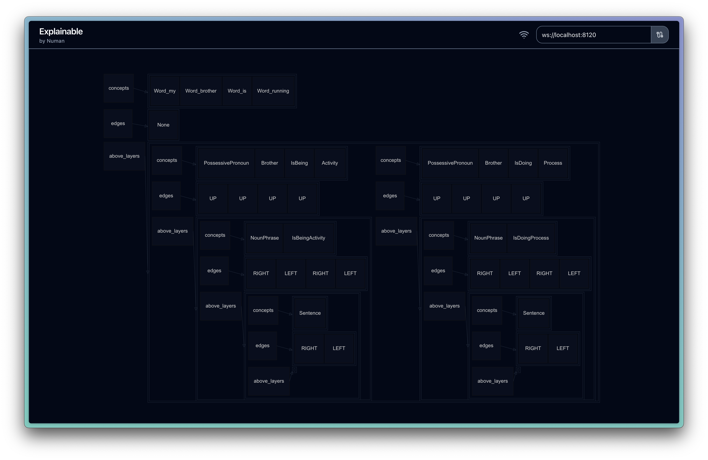
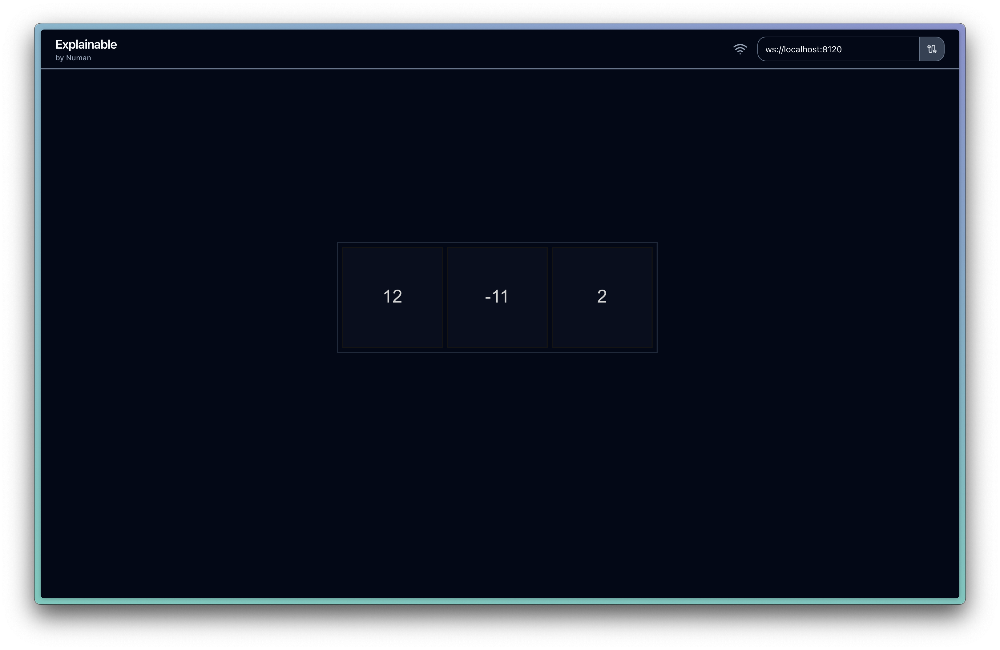

# Explainable

[](https://pypi.org/project/explainable/)

Explainable is a project for real time visualisation of complex data structures with minimal effort.  
This project was created by [Numan Team](https://numan.ai/).  
Visualisation runs on our [website](https://explainable.numan.ai/), so you only need install the library and initialise it in your code.



## Installation

```sh
pip install -U explainable
```

## Usage

1. Install using `pip`
2. Import the library in your code
3. Write a drawing function that returns a `Graph` object
3. Add `explainable.init(<draw_func>)` in your code to start the server
4. Add context using `explainable.add_context()` in your code
5. Go to https://explainable.numan.ai/

```python
import time

import explainable


def draw(cm: explainable.ContextManager):
    ctx = cm.get("my_var", default=0)

    return explainable.Graph([
        explainable.TextNode(f"My var: {ctx}"),
    ], edges=[])


explainable.init(draw)
explainable.add_context()

my_var = 1

while True:
    my_var += 1
    time.sleep(0.5)
```



## Node and edge types

The library provides several node types and edge types. Build a `Graph(nodes, edges)` (or use `Graph()` and call `add_node` / `connect`) and return it from your draw function.

### Nodes

- **TextNode** — Plain text. Optional: `width`, `height`, `background`, `foreground`.

```python
explainable.TextNode("Hello")
explainable.TextNode({"text": "Styled", "width": 120, "background": "#333", "foreground": "#fff"})
```

- **NumberNode** — Displays a numeric value.

```python
explainable.NumberNode({"value": 42.5})
```

- **RowNode** — Lays out children horizontally.

```python
explainable.RowNode({"children": [
    explainable.TextNode("A"),
    explainable.TextNode("B"),
    explainable.TextNode("C"),
]})
```

- **ColumnNode** — Lays out children vertically.

```python
explainable.ColumnNode({"children": [
    explainable.TextNode("First"),
    explainable.TextNode("Second"),
]})
```

- **PixelNode** — Color block. Optional: `size`, or `width` and `height`.

```python
explainable.PixelNode({"color": "#ff0000"})
explainable.PixelNode({"color": "#00ff00", "size": 32})
explainable.PixelNode({"color": "#0000ff", "width": 40, "height": 20})
```

- **LineChartNode** — Line chart from a list of (x, y) points.

```python
explainable.LineChartNode({"data": [(0, 0), (1, 2), (2, 1), (3, 4)]})
```

- **ClickableExclusiveNode** — One-of-many selection: `group` and a `widget` (the node to show for the selected option). Use `cm.get_clickable_exclusive(group)` in your draw function to read the selection.

```python
explainable.ClickableExclusiveNode({"group": "choice", "widget": explainable.TextNode("Option A")})
```

### Edges

- **Edge** — Connects two nodes. Use `Graph.connect(node1, node2, data)` or construct manually. Optional: `line_width`, `line_color`, `label_color`.

```python
g = explainable.Graph()
a = g.add_node(explainable.TextNode("A"))
b = g.add_node(explainable.TextNode("B"))
g.connect(a, b)
# or with custom style:
g.connect(a, b, data="label")
# For manual Edge: explainable.Edge(edge_id="a-b", node_start_id="...", node_end_id="...", line_color="#888")
```

- **ClickableExclusiveEdge** — Edge variant for clickable exclusive behaviour (same fields as `Edge`, different `widget`).

```python
explainable.ClickableExclusiveEdge(
    edge_id="e1",
    node_start_id=node_a.object_id,
    node_end_id=node_b.object_id,
)
```

### Graph helpers

- **Graph(nodes, edges)** — Pass lists of nodes and edges, or use **Graph()** and then:
  - **add_node(node)** — Adds a node (deduplicates by `object_id`), returns the node.
  - **find_node(object_id)** — Returns node by id.
  - **connect(node1, node2, data=None)** — Creates an `Edge` between two nodes and adds it to the graph.

```python
g = explainable.Graph()
n1 = g.add_node(explainable.TextNode("Start"))
n2 = g.add_node(explainable.TextNode("End"))
g.connect(n1, n2)
return g
```

## Requirements

Python 3.9 or higher.
