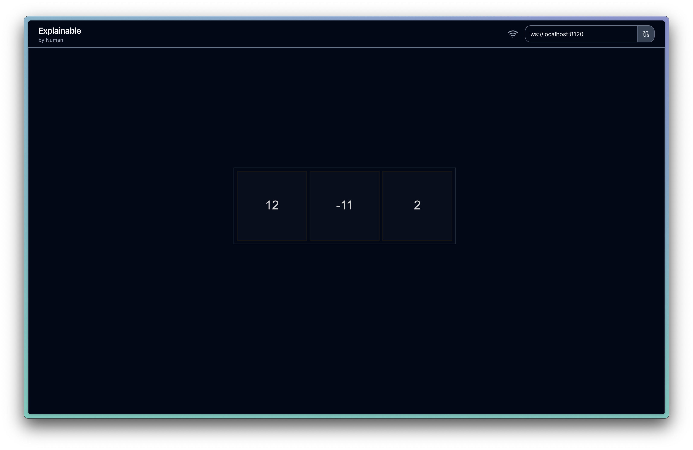

# Explainable

[](https://pypi.org/project/explainable/)

Explainable is a project for visualising complex data structures in real time with minimal effort.  
This project was created by [Numan Team](https://numan.ai/).


## Installation

```sh
pip install -U explainable
```

## Usage

1. Install using `pip`
2. Import the library in your code
3. Add `explainable.init()` in your code to start the server
4. Select data to observe with `data = explainable.observe("my_view", data)`
5. Go to https://explainable.numan.ai/

```python
import time

import explainable

# start the server
explainable.init()

# create your data
lst = [0, 1, 2]

# start observing
lst = explainable.observe("view1", lst)

# change your data
while True:
  lst[0] += 1
  lst[1] -= 1

  time.sleep(1)
```



Currently supported data structures:
- dataclass
- list
- dict
- enums

## Requirements

Python 3.7 or higher.
